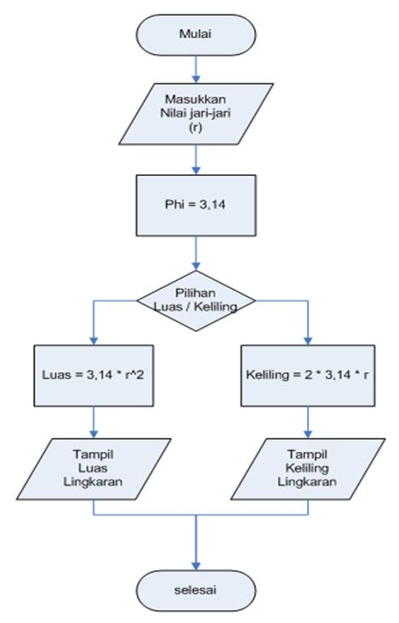

# Praktikum-3
Menghitung luas dan keliling lingkaran
Flowchart menghitung luas dan keliling lingkaran

Langkah - langkah membuat program menghitung luas dan keliling lingkaran

1.Memasukan nilai Jari-jari

2.Deklarasikan variabel

Deklarasikan variabel pi = 3.14 otomatis menggunakan tipe data float karena bernilai desimal
3.Implementasikan rumus perhitungan luas dan keliling lingkaran

Masukan rumus luas = pi (3,14) kalikan (*) dengan nilai jari-jari yang dimasukan int (r) * int (r) dan rumus keliling = 2 * pi * int(r)
4.Cetak hasil perhitungan

5.Run python code dan lihat hasilnya di kolom terminal

Masukan nilai jari-jari lingkaran yang ingin dihitung, maka secara otomatis program akan mencetak hasil dengan sendirinya
6.Opsi lain

Tambahkan "{:.*f}".format(). Simbol bintang pada .*f bisa diubah dengan angka
7.Run python code dan ini hasilnya

